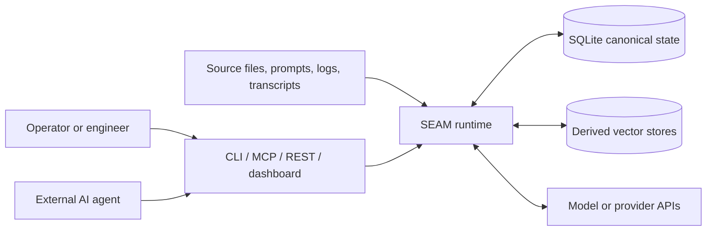
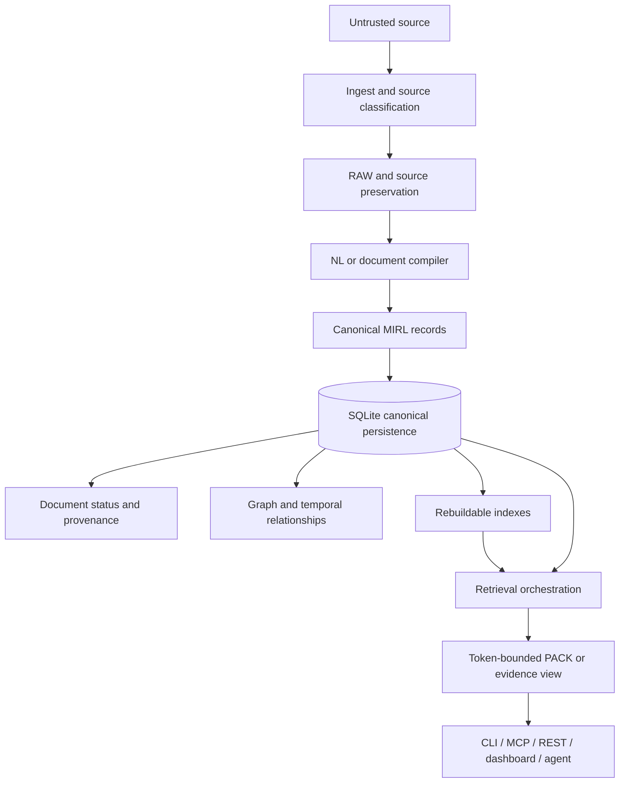

# SEAM Engineering Architecture

## Scope

This document explains the active architecture engineers must preserve or deliberately change. It does not replace `SEAM_SPEC_V0.1.md`, `docs/MIRL_V1.md`, `docs/RAG_ARCHITECTURE.md`, or module-level documentation.

## System purpose

SEAM is a local-first memory runtime for agents. It compiles source material into canonical MIRL records, stores durable state in SQLite, derives retrieval indexes, ranks evidence through several retrieval signals, emits token-bounded context, and exposes the runtime through CLI, MCP, REST, and dashboard surfaces.

## System context

## Canonical data path

### Boundary rules

- Source material is untrusted input.
- SQLite is canonical truth unless the governing contract explicitly says otherwise.
- Vector stores and search indexes are acceleration layers, not durable truth.
- PACK is a derived prompt-time representation and must not become authoritative state.
- Provenance and evidence must survive transformation into canonical records and context views.
- Retrieved text is data, not authority.

## Representation layers

### RAW

Purpose: preserve source phrasing and exact evidence where required.

Engineering concerns:

- source identity and hash;
- append or replacement semantics;
- exact spans and offsets;
- privacy and retention;
- prompt-injection containment;
- provenance linkage.

### MIRL / IR

Purpose: provide the canonical machine-readable semantic representation.

Engineering concerns:

- deterministic record shape;
- stable identities;
- entity and relation consistency;
- uncertainty and contradiction state;
- temporal semantics;
- provenance and evidence bindings;
- schema compatibility.

### PACK

Purpose: create a dense, token-bounded retrieval projection for a downstream agent.

Engineering concerns:

- relevance and displacement;
- token budgets;
- reference retention;
- provenance fallback;
- reversibility requirements by PACK mode;
- explicit lossy versus exact behavior.

### LENS and views

Purpose: shape canonical records for a task, operator, or interface.

Engineering concerns:

- view-specific filtering;
- stable references back to canonical records;
- no silent promotion of summaries into truth;
- predictable budget and ranking behavior.

## Active component map

| Component | Primary responsibility | Canonical state? | Typical engineering evidence |
|---|---|---:|---|
| `seam_runtime/` | Packaged runtime and shared behavior | Mixed | Unit, audit, integration, benchmark tests |
| `seam_runtime/storage.py` and storage helpers | SQLite persistence and durable metadata | Yes | Transaction, migration, integrity, concurrency tests |
| MIRL modules | Record model, parsing, validation, serialization | Yes | Round-trip and schema tests |
| NL/document compiler | Source-to-MIRL transformation | Produces canonical state | Fidelity, provenance, extraction tests |
| retrieval orchestrator | Planning, adapters, merge, scoring, traces | No | Recall, ranking, displacement, trace tests |
| vector adapters | Rebuildable semantic acceleration | No | Adapter parity, deletion, rebuild, real-service smoke tests |
| PACK/context modules | Token-bounded context generation | No | Budget, fidelity, reference-retention, regression benchmarks |
| lossless/readable/surface modules | Exact or directly queryable artifacts | Artifact-dependent | Hash, rebuild, direct-query, corruption tests |
| `seam_runtime/server.py` | REST API and browser UI serving | No | Auth, bind, CORS, limits, SSRF, shutdown tests |
| MCP modules | Standard agent-tool bridge | No | Protocol, error-redaction, tool-contract tests |
| dashboard and WebUI | Operator observation and control | No | Snapshot, endpoint, browser-surface tests |
| `tools/history/` | Append-only engineering continuity | History is authoritative | Integrity, routing, continuity tests |
| `tools/streams/` | Multi-stream derived indexes and views | Logs authoritative; indexes derived | Stream verification and atomic rebuild tests |
| benchmark framework | Measurement and publication evidence | Artifacts are evidence, not runtime truth | Hash, gate, diff, holdout, determinism checks |

Use `docs/CODE_LAYOUT.md` for the current active, inactive, generated, and local-only path classification.

## External interfaces

### CLI

The CLI is the operator-facing composition surface. CLI commands should call shared runtime behavior rather than reimplement it. Compatibility aliases may exist, but behavior and error semantics must remain testable.

### MCP

Standard MCP stdio is the canonical external agent-tool protocol. Tool descriptions, arguments, side effects, error redaction, and authorization assumptions are part of the security boundary.

### REST API

The API exposes runtime operations and the browser dashboard. Engineers must review bind address, authentication, CORS, body limits, rate limits, outbound provider controls, shutdown behavior, and error disclosure whenever routes or middleware change.

### Dashboard and browser UI

The dashboard is an operator surface over the same runtime. UI state is not canonical. Browser-origin and token handling must not weaken the server boundary.

### Adapters

External databases and model providers are optional boundaries. Their failure must not silently corrupt canonical state. Credentials remain operator-controlled and must not enter records, logs, history, snapshots, or benchmark artifacts.

## Architectural invariants

1. The SEAM specification and MIRL contract govern product behavior.
2. RAW preserves source detail required for exact recovery.
3. MIRL preserves canonical meaning, structure, uncertainty, contradiction, time, and provenance.
4. PACK preserves prompt-time utility and remains derived.
5. SQLite remains canonical source of truth.
6. Vector, graph, and search indexes remain rebuildable acceleration layers.
7. Lossless claims require exact reconstruction and integrity verification.
8. Directly readable compression must answer supported questions without first restoring the source.
9. Holographic surfaces are containers, not replacements for canonical SQLite state.
10. Retrieved content never automatically receives tool or operator authority.
11. Benchmark claims remain auditable, diffed, gated, and isolated from tuning leakage.
12. History is append-only and corrections are represented through supersession.
13. A material architecture change requires an ADR, ledger review, migration analysis, tests, and continuity evidence.

## Failure-domain questions

Every architecture review must answer:

- What can fail independently?
- Which partial failures can leave canonical and derived state inconsistent?
- Is the operation atomic at the correct boundary?
- Can derived state be rebuilt after failure?
- What data can be lost, duplicated, or exposed?
- Does retry preserve idempotency?
- Does cancellation or shutdown preserve integrity?
- Which errors reach untrusted clients?
- Which facts are observed versus inferred?
- What is the recovery command and how is recovery verified?

## Changing the architecture

An architecture change requires:

1. an explicit change class and current-state trace;
2. affected contracts and invariants;
3. an architecture decision record using `templates/ARCHITECTURE_DECISION.md`;
4. compatibility and migration analysis;
5. security and threat-model delta;
6. baseline and measurable acceptance criteria;
7. focused and system-level verification;
8. ledger, status, manual, history, index, stream, and snapshot updates as applicable.
