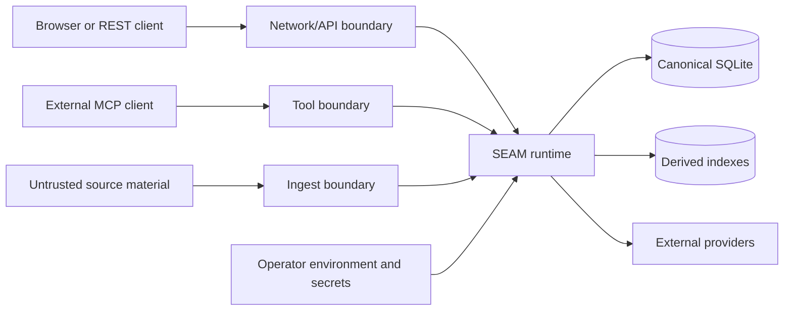

# SEAM Security Architecture

## Purpose

This document defines the security model engineers must apply when designing, changing, or reviewing SEAM. `SECURITY.md` remains the vulnerability-reporting policy. This document is the engineering threat-model and secure-change guide.

## Security stance

SEAM is local-first, but local-first does not mean trusted-by-default. Source files, prompts, retrieved memory, model responses, adapter responses, tool output, compressed artifacts, benchmark fixtures, and provider content may be malicious, malformed, stale, or incorrect.

Natural-language content recovered from memory never gains authority to:

- invoke tools;
- modify files or configuration;
- disclose secrets or private records;
- spend money;
- select a provider;
- widen network exposure;
- mutate or delete canonical state.

Authority must come from authenticated operator intent, explicit policy, scoped tool permissions, and validated execution paths.

## Protected assets

- canonical SQLite records and document status;
- RAW source material and exact evidence spans;
- MIRL provenance, temporal state, contradictions, and confidence;
- credentials, tokens, private keys, DSNs, local environment files, and provider sessions;
- user and customer memory;
- benchmark holdout data, judges, case hashes, fixture hashes, and publication bundles;
- history, ledgers, snapshots, route manifests, and stream integrity;
- installer, release, and update paths;
- MCP, REST, CLI, and dashboard authority;
- system availability and bounded compute.

## Actors

- authenticated local operator;
- contributing engineer;
- autonomous engineering agent;
- external MCP client;
- browser client;
- remote or local model provider;
- untrusted document author;
- malicious local process;
- compromised dependency or adapter;
- accidental operator error.

## Trust boundaries

Boundary-specific requirements:

| Boundary | Required controls |
|---|---|
| Source to ingest | type and size validation, bounded parsing, provenance, injection-aware treatment, safe paths |
| Client to REST | safe bind defaults, authentication, CORS, body/rate budgets, error redaction, SSRF controls |
| Client to MCP | protocol validation, bounded arguments, side-effect clarity, generic external errors, logging without secrets |
| Runtime to SQLite | transactions, schema validation, locking, rollback, integrity checks, least file access |
| Runtime to derived indexes | rebuildability, consistency checks, deletion parity, adapter failure isolation |
| Runtime to providers | allowlisted destinations, credential isolation, timeouts, bounded payloads, no arbitrary redirects |
| Runtime to artifacts | hashes, format validation, exactness gates, corruption handling, no implicit execution |
| Engineer to repo | branch protection, secret scan, review, reproducible tests, append-only continuity |

## Threat classes

### Conventional application threats

Review for:

- command, SQL, template, and shell injection;
- path traversal and unsafe file overwrite;
- unsafe deserialization;
- credential disclosure;
- unauthenticated non-loopback exposure;
- permissive CORS;
- rate-limit bypass;
- unbounded request, context, memory, disk, and compute use;
- SSRF and unsafe redirects;
- dependency and supply-chain compromise;
- non-atomic persistence and rollback;
- race conditions and missing locks;
- sensitive exception leakage;
- unsafe shutdown or partial writes;
- insecure temporary files and permissions.

### AI-memory threats

#### Stored prompt injection

A malicious document or memory can contain instructions intended for a later model. Store and retrieve it as evidence, but do not place it in a privileged instruction channel or interpret it as authorization.

Required controls:

- preserve source/provenance;
- label retrieved blocks as untrusted evidence;
- separate system policy from memory content;
- keep tool authorization outside retrieved text;
- test direct and indirect injection cases.

#### Memory poisoning

An attacker or faulty extractor may insert false, contradictory, or adversarial records.

Required controls:

- authenticated write paths where appropriate;
- explicit status, confidence, contradiction, supersession, and evidence;
- source-scoped deletion and repair;
- audit trails;
- no silent overwrite of competing claims.

#### Cross-scope leakage

Retrieval may expose records from another user, project, namespace, or tenant-like scope.

Required controls:

- apply scope filtering before ranking and packing;
- test negative isolation cases;
- do not rely on post-retrieval redaction as the primary control;
- preserve scope through derived indexes.

#### Provenance spoofing

A record may claim evidence it did not originate from.

Required controls:

- validate referenced source and evidence identifiers;
- bind hashes and offsets where applicable;
- reject or quarantine malformed references;
- expose provenance in evidence views and traces.

#### Embedding and retrieval manipulation

Adversarial text may dominate similarity search, create collisions, or displace relevant evidence.

Required controls:

- compare lexical, graph, temporal, and vector signals;
- cap candidate and context budgets;
- measure displacement and precision, not recall alone;
- retain deterministic fallback paths;
- treat vector results as derived hints.

#### Stale or superseded state resurfacing

Old records may outrank current state.

Required controls:

- explicit temporal and status semantics;
- reconciliation and supersession-aware ranking;
- tests covering contradictions and state transitions;
- evidence views that reveal why a record was selected.

#### Malicious compressed artifacts

Readable compression, byte envelopes, or holographic surfaces may be malformed or deliberately oversized.

Required controls:

- strict headers, lengths, dimensions, hashes, and format allowlists;
- bounded allocation before decode;
- reject lossy formats for exact workflows;
- corruption tests;
- never execute embedded content.

### Agentic threats

- excessive MCP tool authority;
- hidden side effects;
- confused-deputy requests;
- tool-output injection;
- autonomous destructive writes;
- autonomous paid evaluation;
- arbitrary provider or endpoint selection;
- secrets copied into prompts, logs, records, snapshots, or artifacts;
- model-generated commands executed without validation.

Controls must include explicit side-effect documentation, least authority, argument validation, operator confirmation for high-impact actions, and stable audit evidence.

### Benchmark and evidence threats

- holdout leakage;
- tuning on publication cases;
- nondeterministic judges presented as stable evidence;
- fixture or report tampering;
- omitted failures;
- cherry-picked cases;
- unsealed or unverifiable bundles;
- cost-bearing execution without approval;
- claiming production quality from smoke tests.

## Security invariants

1. Secrets and private session URLs never enter source control, history, snapshots, docs, logs, benchmark reports, or chat responses.
2. Non-loopback exposure requires explicit security controls and operator intent.
3. Untrusted input does not become executable authority.
4. Canonical writes are atomic at the failure boundary they claim to protect.
5. Derived-state failure does not silently erase canonical state.
6. External errors are redacted; detailed diagnostics remain operator-side.
7. Paid and holdout evaluation remain explicitly gated.
8. Security controls cannot be disabled merely to make a test or demo pass.
9. Security claims must link to implementation and a test or documented operational control.

## Threat-model delta procedure

For every security-sensitive change, complete `templates/THREAT_MODEL_DELTA.md`:

1. Identify changed entrypoints and trust boundaries.
2. List assets newly read, written, transmitted, or exposed.
3. Identify new attacker-controlled fields.
4. Describe abuse cases and partial failures.
5. Map preventive, detective, and recovery controls.
6. Add negative tests and malformed-input tests.
7. State residual risks and operator assumptions.
8. Confirm logging and artifacts contain no sensitive values.

## Security verification expectations

At minimum, applicable changes should test:

- unauthenticated and unauthorized requests;
- loopback versus non-loopback binding;
- malformed, oversized, and boundary-value inputs;
- path and command injection characters;
- error redaction using secret-shaped exception text;
- concurrent writes and rollback failures;
- deletion parity across canonical and derived stores;
- scope-isolation negatives;
- stored prompt-injection behavior;
- provider URL and redirect restrictions;
- artifact corruption and allocation bounds;
- shutdown while work is in flight;
- secret and provider-session URL scans.

## Incident triggers

Immediately enter the incident SOP when any of these occurs:

- committed credential or private session URL;
- unauthorized network exposure;
- cross-scope memory disclosure;
- canonical-state corruption or unexplained deletion;
- benchmark holdout leakage;
- compromised dependency or installer path;
- malicious artifact causing unsafe behavior;
- tool execution sourced from retrieved content without valid authorization;
- evidence that published benchmark claims cannot be reproduced.

See `08_INCIDENT_RESPONSE.md`.
